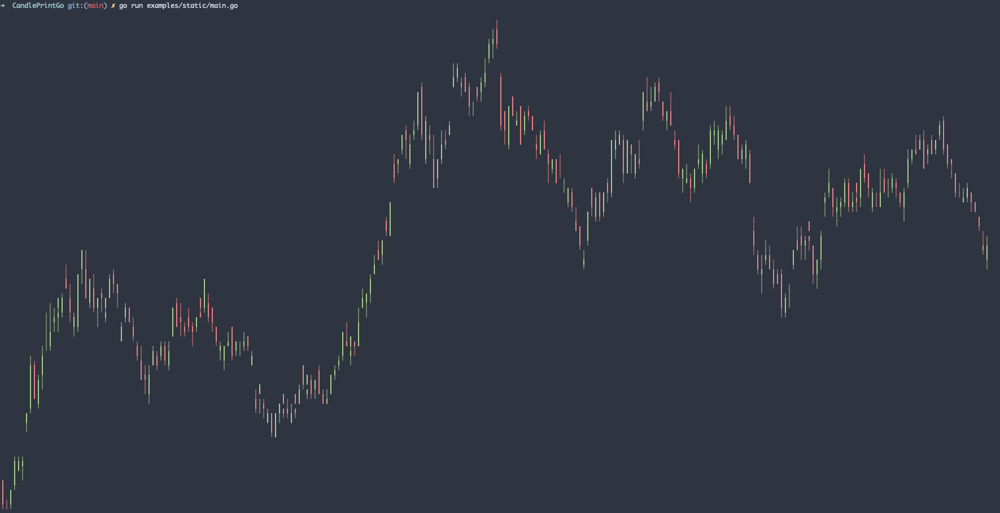

<div align="center">
    
    
</div>

# CandlePrintGo

CandlePrintGo is a small package that lets you print candle charts in the terminal.

## Features
 * Color profile selection
 * Simple use library

## Usage

Create a `CandleChart` passing an array of `Candle` and `height`.

```go
package main

import (
	"fmt"
	
	"github.com/bitcolibri/candlePrintGo"
	"github.com/muesli/termenv"
)

func main() {
	profile := candlePrintGo.NewColorProfile(termenv.ColorProfile(), "#A8CC8C", "#E88388")
	
	data := []candlePrintGo.Candle{
		candlePrintGo.NewCandleBar(255.49, 261.50, 253.42, 260.64),
		candlePrintGo.NewCandleBar(257.89, 261.32, 253.50, 259.61),
		candlePrintGo.NewCandleBar(258.14, 264.57, 257.13, 262.51),
		candlePrintGo.NewCandleBar(262.26, 267.10, 261.42, 265.89),
	}
	chart := candlePrintGo.NewCandleChart(data, 50, candlePrintGo.WithColorProfile(profile))
	fmt.Println(chart.Render())
}
```

Check the [example](examples/static/main.go)

## To Do
* Print price alongside the candles
* Dynamic chart example
* Develop BubbleTea component

## Thanks
Image was created with [gopher-stickers](https://github.com/tenntenn/gopher-stickers).

This repo was inspired by [termgraph](https://github.com/sgeisler/termgraph).